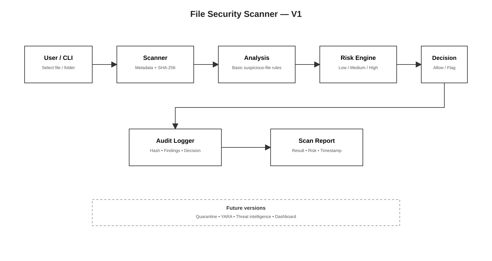

# File Security Scanner

A Python-based defensive file security scanner that calculates SHA-256 hashes, performs basic file analysis, assigns a risk level, records local audit logs, and provides both a command-line and desktop interface.

## Overview

This project is a personal cybersecurity learning and portfolio project focused on understanding how file scanning and security analysis tools are structured.

The scanner currently performs local analysis of user-selected files and produces a risk assessment based on the indicators detected. It also generates an audit record for each scan.

The project is designed to be extended with more advanced detection capabilities in future versions.

## Current Features

- SHA-256 file hashing
- Basic file analysis
- Risk assessment
- Local audit logging
- Human-readable scan reports
- Command-line interface
- Windows desktop GUI
- Standalone Windows executable
- Test fixtures and scanner testing

## Architecture

The current scanner follows this general flow:

File Selection → File Scanner → SHA-256 Hashing → File Analysis → Risk Assessment → Audit Logging → Report / GUI Output

The project separates these responsibilities into individual Python modules to keep the scanner modular and easier to extend.

